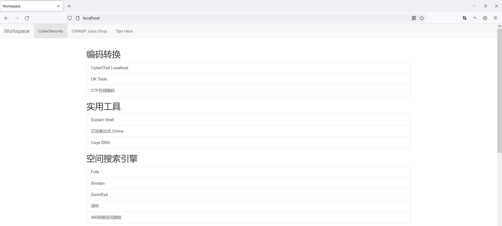

<a name="index">**Index**</a>
<a href="#0">Awesome-Redteam</a>  
&emsp;<a href="#1">目录概览</a>  
&emsp;<a href="#2">网站导航</a>  
&emsp;&emsp;<a href="#3">编码转换</a>  
&emsp;&emsp;<a href="#4">实用工具</a>  
&emsp;&emsp;<a href="#5">IP/域名收集</a>  
&emsp;&emsp;&emsp;<a href="#6">确认真实IP地址</a>  
&emsp;&emsp;&emsp;<a href="#7">多个地点Ping服务器</a>  
&emsp;&emsp;&emsp;<a href="#8">Whois注册信息反查</a>  
&emsp;&emsp;&emsp;<a href="#9">DNS数据聚合查询</a>  
&emsp;&emsp;&emsp;<a href="#10">TLS证书信息查询</a>  
&emsp;&emsp;&emsp;<a href="#11">IP地址段收集</a>  
&emsp;&emsp;<a href="#12">网络空间搜索</a>  
&emsp;&emsp;<a href="#13">威胁情报平台</a>  
&emsp;&emsp;<a href="#14">CTF平台</a>  
&emsp;&emsp;<a href="#15">漏洞平台</a>  
&emsp;&emsp;<a href="#16">靶机平台</a>  
&emsp;&emsp;<a href="#17">公开知识库</a>  
&emsp;<a href="#18">信息收集</a>  
&emsp;&emsp;<a href="#19">指纹识别</a>  
&emsp;&emsp;&emsp;<a href="#20">国外指纹识别工具</a>  
&emsp;&emsp;&emsp;<a href="#21">国内指纹识别工具</a>  
&emsp;&emsp;&emsp;<a href="#22">在线指纹识别工具</a>  
&emsp;&emsp;<a href="#23">目录扫描</a>  
&emsp;&emsp;<a href="#24">子域名爆破</a>  
&emsp;&emsp;<a href="#25">综合信息收集</a>  
&emsp;&emsp;<a href="#26">内网信息收集</a>  
&emsp;<a href="#27">漏洞研究</a>  
&emsp;&emsp;<a href="#28">漏洞综述</a>  
&emsp;&emsp;<a href="#29">漏洞挖掘</a>  
&emsp;&emsp;<a href="#30">开源项目</a>  
&emsp;&emsp;<a href="#31">漏洞EXP</a>  
&emsp;<a href="#32">内网渗透</a>  
&emsp;&emsp;<a href="#33">命令行</a>  
&emsp;&emsp;<a href="#34">Bypass</a>  
&emsp;&emsp;<a href="#35">Payload</a>  
&emsp;&emsp;<a href="#36">WebShell</a>  
&emsp;&emsp;<a href="#37">内网穿透</a>  
&emsp;&emsp;<a href="#38">其他</a>  
&emsp;<a href="#39">工具赋能</a>  
&emsp;&emsp;<a href="#40">Cobaltstrike</a>  
&emsp;&emsp;<a href="#41">Burpsuite</a>  
&emsp;&emsp;<a href="#42">Chrome crx</a>  
&emsp;&emsp;<a href="#43">Xray</a>  
&emsp;<a href="#44">使用姿势</a>  
&emsp;&emsp;<a href="#45">如何在Windows上使用alias</a>  
&emsp;&emsp;<a href="#46">如何使用浏览器快速查看markdown文档</a>  
# <a name="0">Awesome-Redteam</a><a style="float:right;text-decoration:none;" href="#index">[Top]</a>
轻量化红队知识仓库，不定期更新。

markdown文档与Linux alias命令或Windows doskey命令联动，可实现终端快捷查询。

## <a name="1">目录概览</a><a style="float:right;text-decoration:none;" href="#index">[Top]</a>

**网站导航**

- 编码转换
- 实用工具
- IP/域名收集
  - 确认真实IP地址
  - 多个地点Ping服务器
  - Whois注册信息反查
  - DNS数据聚合查询
  - IP地址段收集
- 网络空间搜索
- 威胁情报平台
- CTF平台
- 漏洞平台
- 靶机平台

**信息收集**

- 指纹识别
  - 国外指纹识别工具
  - 国内指纹识别工具
  - 在线指纹识别工具
- 目录扫描
- 子域名爆破
- 综合信息收集
- 内网信息收集

**漏洞研究**

- 漏洞综述
- 漏洞挖掘
- 开源项目
- 漏洞EXP

**内网渗透**

- 命令行
- Bypass
- Payload
- Webshell

**工具赋能**

- Cobaltstrike
- Burpsuite
- Chrome crx
- Xray

## <a name="2">网站导航</a><a style="float:right;text-decoration:none;" href="#index">[Top]</a>

### <a name="3">编码转换</a><a style="float:right;text-decoration:none;" href="#index">[Top]</a>

- CyberChef：编解码及加密，可本地部署 https://github.com/gchq/CyberChef
- OK Tools在线工具：https://github.com/wangyiwy/oktools
- CTF在线工具：http://www.hiencode.com/
- Unicode字符表：https://www.52unicode.com/enclosed-alphanumerics-zifu

### <a name="4">实用工具</a><a style="float:right;text-decoration:none;" href="#index">[Top]</a>

- Explain Shell：Shell命令解析 https://explainshell.com/
- 在线正则表达式：https://c.runoob.com/front-end/854/
- Ceye DNS：DNS oob平台 http://ceye.io/
- Webshell Chop：https://webshellchop.chaitin.cn/demo/
- XSS Chop：https://xsschop.chaitin.cn/demo/
- WebShell查杀：https://n.shellpub.com/
- Google Hacking Database：https://www.exploit-db.com/google-hacking-database
- Wayback Machine：网页缓存查询 https://archive.org/web

### <a name="5">IP/域名收集</a><a style="float:right;text-decoration:none;" href="#index">[Top]</a>

#### <a name="6">确认真实IP地址</a><a style="float:right;text-decoration:none;" href="#index">[Top]</a>

- IP精准定位：https://www.ipuu.net/#/home
- IP 138：https://site.ip138.com/
- Security Trails：https://securitytrails.com/

#### <a name="7">多个地点Ping服务器</a><a style="float:right;text-decoration:none;" href="#index">[Top]</a>

- Chinaz：https://ping.chinaz.com/
- Host Tracker：https://www.host-tracker.com/
- Webpage Test：https://www.webpagetest.org/
- DNS Check：https://dnscheck.pingdom.com/

#### <a name="8">Whois注册信息反查</a><a style="float:right;text-decoration:none;" href="#index">[Top]</a>

- 站长之家 Whois：https://whois.chinaz.com/
- 中国万网 Whois：https://whois.aliyun.com/
- 国际 Whois：https://who.is/

#### <a name="9">DNS数据聚合查询</a><a style="float:right;text-decoration:none;" href="#index">[Top]</a>

- Hacker Target：https://hackertarget.com/find-dns-host-records
- DNS Dumpster：https://dnsdumpster.com
- DNS DB：https://dnsdb.io/zh-cn

#### <a name="10">TLS证书信息查询</a><a style="float:right;text-decoration:none;" href="#index">[Top]</a>

- Censys：https://censys.io
- Certificate Search：https://crt.sh
- 证书透明度监控：https://developers.facebook.com/tools/ct"

#### <a name="11">IP地址段收集</a><a style="float:right;text-decoration:none;" href="#index">[Top]</a>

- CNNIC中国互联网信息中心：http://ipwhois.cnnic.net.cn

### <a name="12">网络空间搜索</a><a style="float:right;text-decoration:none;" href="#index">[Top]</a>

- Fofa：https://fofa.info/
- Shodan：https://www.shodan.io/
- ZoomEye：https://www.zoomeye.org/
- 谛听：https://www.ditecting.com/
- 360网络空间测绘：https://quake.360.cn/quake/#/index

### <a name="13">威胁情报平台</a><a style="float:right;text-decoration:none;" href="#index">[Top]</a>

- Virustotal：https://www.virustotal.com/gui/home/upload
- 腾讯哈勃分析系统：https://habo.qq.com/tool/index
- 微步在线威胁情报：https://x.threatbook.cn/
- 奇安信威胁情报：https://ti.qianxin.com/
- 360威胁情报：https://ti.360.net/#/homepage
- 安恒威胁情报：https://ti.dbappsecurity.com.cn/
- 火线安全平台：https://www.huoxian.cn

### <a name="14">CTF平台</a><a style="float:right;text-decoration:none;" href="#index">[Top]</a>

- CTF Wiki：https://ctf-wiki.org/
- CTF Time：https://ctftime.org/
- CTF Tools：https://github.com/zardus/ctf-tools
- 攻防世界：https://adworld.xctf.org.cn/

### <a name="15">漏洞平台</a><a style="float:right;text-decoration:none;" href="#index">[Top]</a>

- Exploit Database：https://www.exploit-db.com/
- HackerOne：https://www.hackerone.com/
- Vulhub：https://vulhub.org/
- 乌云镜像：http://wooyun.2xss.cc/
- 知道创宇漏洞平台：https://www.seebug.org/

### <a name="16">靶机平台</a><a style="float:right;text-decoration:none;" href="#index">[Top]</a>

- HackTheBox：https://www.hackthebox.com/

### <a name="17">公开知识库</a><a style="float:right;text-decoration:none;" href="#index">[Top]</a>

- 

## <a name="18">信息收集</a><a style="float:right;text-decoration:none;" href="#index">[Top]</a>

### <a name="19">指纹识别</a><a style="float:right;text-decoration:none;" href="#index">[Top]</a>

#### <a name="20">国外指纹识别工具</a><a style="float:right;text-decoration:none;" href="#index">[Top]</a>

- WhatWeb：开源网站指纹识别软件 https://github.com/urbanadventurer/WhatWeb
- Wapplyzer：Chrome插件 跨平台网站分析工具 https://github.com/AliasIO/Wappalyzer
- Whatruns：Chrome 插件 web指纹识别程序 https://www.whatruns.com/
- Plecost：Wordpress漏洞指纹识别 https://github.com/iniqua/plecost

#### <a name="21">国内指纹识别工具</a><a style="float:right;text-decoration:none;" href="#index">[Top]</a>

- TideFinger：提取了多个开源指纹识别工具的规则库并进行了规则重组 https://github.com/TideSec/TideFinger
- 御剑web指纹识别程序：https://www.webshell.cc/4697.html

#### <a name="22">在线指纹识别工具</a><a style="float:right;text-decoration:none;" href="#index">[Top]</a>

- 云悉指纹识别：http://www.yunsee.cn/

### <a name="23">目录扫描</a><a style="float:right;text-decoration:none;" href="#index">[Top]</a>

- dirsearch：https://github.com/maurosoria/dirsearch

### <a name="24">子域名爆破</a><a style="float:right;text-decoration:none;" href="#index">[Top]</a>

- ksubdomain：https://github.com/knownsec/ksubdomain

### <a name="25">综合信息收集</a><a style="float:right;text-decoration:none;" href="#index">[Top]</a>

- AlliN：https://github.com/P1-Team/AlliN
- Kunyu：https://github.com/knownsec/Kunyu
- OneForAll：https://github.com/shmilylty/OneForAll
- ShuiZe：https://github.com/0x727/ShuiZe_0x727
- Fofa Viewer：https://github.com/wgpsec/fofa_viewer

### <a name="26">内网信息收集</a><a style="float:right;text-decoration:none;" href="#index">[Top]</a>

- fscan：内网综合扫描工具 https://github.com/shadow1ng/fscan

## <a name="27">漏洞研究</a><a style="float:right;text-decoration:none;" href="#index">[Top]</a>

### <a name="28">漏洞综述</a><a style="float:right;text-decoration:none;" href="#index">[Top]</a>

- 未授权访问漏洞总结：http://luckyzmj.cn/posts/15dff4d3.html#toc-heading-3

### <a name="29">漏洞挖掘</a><a style="float:right;text-decoration:none;" href="#index">[Top]</a>

- Windows-Exploit-Suggester：https://github.com/AonCyberLabs/Windows-Exploit-Suggester
- Linux_Exploit_Suggester：https://github.com/InteliSecureLabs/Linux_Exploit_Suggester

### <a name="30">开源项目</a><a style="float:right;text-decoration:none;" href="#index">[Top]</a>

- Vulhub：https://vulhub.org/
- PeiQi文库：http://wiki.peiqi.tech/

- PoCBox：https://github.com/0verSp4ce/PoCBox
- Vulnerability：https://github.com/EdgeSecurityTeam/Vulnerability
- POChouse：https://github.com/DawnFlame/POChouse

### <a name="31">漏洞EXP</a><a style="float:right;text-decoration:none;" href="#index">[Top]</a>

- ysoserial：https://github.com/frohoff/ysoserial

## <a name="32">内网渗透</a><a style="float:right;text-decoration:none;" href="#index">[Top]</a>

### <a name="33">命令行</a><a style="float:right;text-decoration:none;" href="#index">[Top]</a>

- The art of command line：https://github.com/jlevy/the-art-of-command-line

### <a name="34">Bypass</a><a style="float:right;text-decoration:none;" href="#index">[Top]</a>

- PHPFuck：https://github.com/splitline/PHPFuck
- JSFuck：http://www.jsfuck.com/

### <a name="35">Payload</a><a style="float:right;text-decoration:none;" href="#index">[Top]</a>

- PayloadsAllTheThings：https://github.com/swisskyrepo/PayloadsAllTheThings

### <a name="36">WebShell</a><a style="float:right;text-decoration:none;" href="#index">[Top]</a>

- Behinder 冰蝎：https://github.com/rebeyond/Behinder
- Godzilla 哥斯拉：https://github.com/BeichenDream/Godzilla

### <a name="37">内网穿透</a><a style="float:right;text-decoration:none;" href="#index">[Top]</a>

- nps：通过web端管理，无需配置文件 https://github.com/ehang-io/nps
- frp：55k star项目 https://github.com/fatedier/frp
- Neo-reGeorg：tunnel快速部署 https://github.com/L-codes/Neo-reGeorg

### <a name="38">其他</a><a style="float:right;text-decoration:none;" href="#index">[Top]</a>

- Responder：https://github.com/SpiderLabs/Responder
- CDK：容器渗透 https://github.com/cdk-team/CDK

## <a name="39">工具赋能</a><a style="float:right;text-decoration:none;" href="#index">[Top]</a>

### <a name="40">Cobaltstrike</a><a style="float:right;text-decoration:none;" href="#index">[Top]</a>

- Erebus：后渗透测试插件 https://github.com/DeEpinGh0st/Erebus
- LSTAR：综合后渗透插件 https://github.com/lintstar/LSTAR
- ElevateKit：提权插件 https://github.com/rsmudge/ElevateKit

### <a name="41">Burpsuite</a><a style="float:right;text-decoration:none;" href="#index">[Top]</a>

- HaE：高亮标记与信息提取辅助型插件 https://github.com/gh0stkey/HaE
- Log4j2Scan：Log4j主动扫描 https://github.com/whwlsfb/Log4j2Scan

### <a name="42">Chrome crx</a><a style="float:right;text-decoration:none;" href="#index">[Top]</a>

- Proxy SwitchyOmega：快速切换代理 https://github.com/FelisCatus/SwitchyOmega
- Wappalyzer：识别网站技术/框架/语言 https://www.wappalyzer.com/
- EditThisCookie：修改Cookie https://www.editthiscookie.com/
- FindSomething：在网页的源代码或js中寻找有用信息 https://github.com/ResidualLaugh/FindSomething
- Disable JavaScript：禁用JavaScript绕过弹窗 https://github.com/dpacassi/disable-javascript
- Hunter：查找网页暴露邮箱 https://hunter.io/chrome

### <a name="43">Xray</a><a style="float:right;text-decoration:none;" href="#index">[Top]</a>

- Xray：安全评估工具 https://github.com/chaitin/xray

## <a name="44">使用姿势</a><a style="float:right;text-decoration:none;" href="#index">[Top]</a>

### <a name="45">如何在Windows上使用alias</a><a style="float:right;text-decoration:none;" href="#index">[Top]</a>

- 创建alias.bat，文件内容如下。

```
@echo off
::Tips
@DOSKEY httpcode=type "D:\Hack Tools\Tips\http_status_code.md"
@DOSKEY versions=type "D:\Hack Tools\Tips\versions.md"
@DOSKEY owasp=type "D:\Hack Tools\Tips\owasp.md"
```

- 注册表打开`计算机\HKEY_CURRENT_USER\Software\Microsoft\Command Processor`。
- 创建字符串值`autorun`，赋值为alias.bat所在位置，例如`D:\Software\alias.bat`。
- 双击alias.bat运行，重启cmd。
- 此时在终端输入httpcode，即可返回文件内容。


> 解决cmd中文乱码的问题：
>
> 1. 注册表打开`计算机\HKEY_LOCAL_MACHINE\SOFTWARE\Microsoft\Command Processor`。
> 2. 创建字符串值`autorun`，赋值为`chcp 65001`。

### <a name="46">如何使用浏览器快速查看markdown文档</a><a style="float:right;text-decoration:none;" href="#index">[Top]</a>

- 安装插件`Markdown Viewer`。
- 配合Bootstrap可以实现快速部署导航页或文档库。



